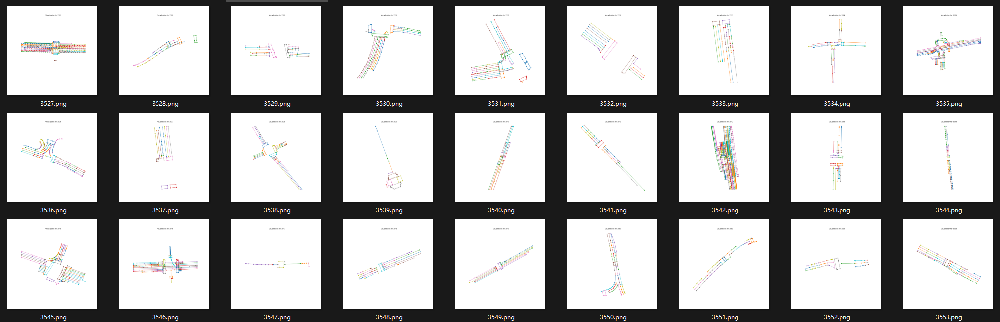

# EGC-VMAP

This is the official implementation of EGC-VMAP: End-to-End Generation of City-Scale Vectorized Maps by Crowdsourced Vehicles, which has been accepted by IEEE ITSC 2025.
## Environment
* Python=3.7
* PyTorch=1.11.0
* numpy=1.21.5

## Datasets
* **data**: It is a real-world Vectorized Maps dataset sourced from a well-known Chinese map service provider.
* Baidu Drive:[https://pan.baidu.com/s/1YAmI-RRLsAl2T8UuPKMg-Q?pwd=8i73 提取码：8i73](https://pan.baidu.com/s/1YAmI-RRLsAl2T8UuPKMg-Q?pwd=8i73 (Access code: 8i73))
  
* For the full datasets of EGC-VMAP, please feel free to contact 1801210364@pku.edu.com

## Code
* The source code of EGC-VMAP
